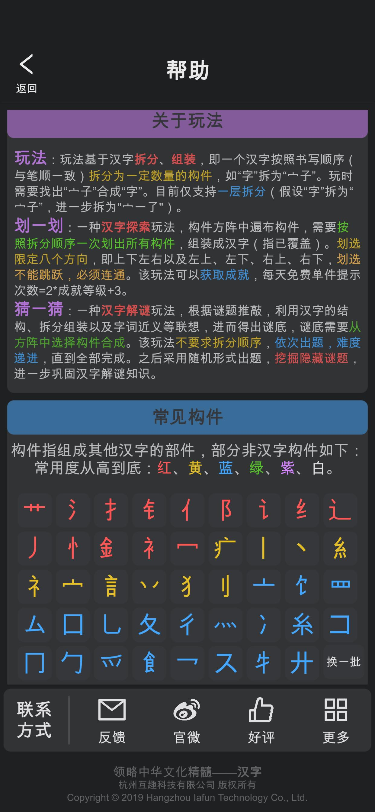
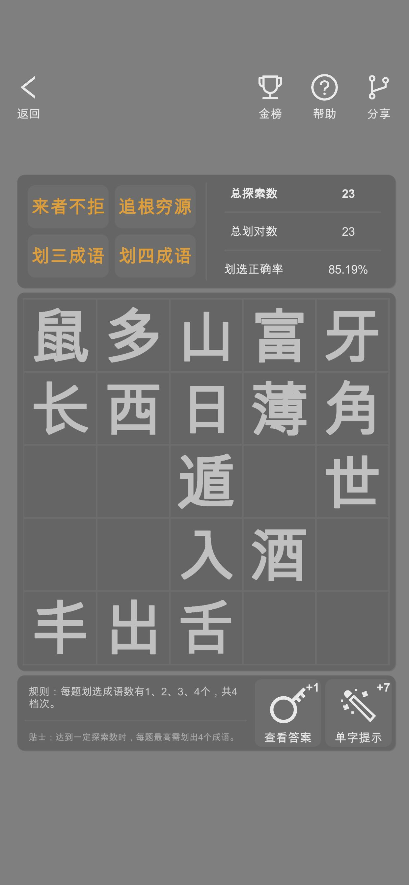

# 项目背景
多年前用unity开发的两个app（同一套源码），现在开源出来，有兴趣的朋友可以随便玩耍。这个数据库还是有点价值的，特别是谜语部分，我收集整理了很久。关于汉字拆解，更是研究了很长时间。

## App下载体验

- **App Store**: [汉字](https://apps.apple.com/cn/app/%E6%B1%89%E5%AD%97/id1450896243)

> **汉字，承载千年文化；一划一猜，点亮智慧火花。**

- **App Store**: [成语迷](https://apps.apple.com/cn/app/%E6%88%90%E8%AF%AD%E8%BF%B7/id1469655291)

> **成语千载，智慧传承；一划一猜，文化生辉。**

## HZ（汉字）

> **寓教于乐，探索汉字之美**

“汉字”是一款以中华汉字文化为核心的移动应用，融合学习、探索与解谜的创新体验，让用户在轻松的游戏化交互中深入了解汉字的构造、含义与文化内涵。覆盖近9000个汉字，搭配丰富的功能模块，无论是汉字爱好者还是文化探索者，都能在这款应用中找到乐趣与启发。

  
  
  
  
  

### 设计初衷

“汉字”致力于通过现代科技弘扬中华传统文化，以寓教于乐的方式让用户在游戏中学习汉字、感受文化之美。我们的目标是让每一位用户在探索汉字的过程中，感受到中华文化的深厚底蕴与无穷魅力。

### 核心功能

- **汉字查询与收集**：支持快速查询汉字信息，包括拼音、释义及英文翻译，轻松构建个人汉字库。
- **手写识别与国色收集**：通过手写输入汉字，解锁独特的国风色彩收集机制，增添交互趣味。
- **成语查询与接龙**：内置成语数据库，支持成语查询与接龙玩法，助力用户出口成章。
- **诗词查询与飞花令**：涵盖唐诗、宋词、诗经等经典内容，助力飞花令挑战，感受诗意中国。
- **汉字灯谜解谜**：提供数千道汉字谜题，配备详尽谜底解析，激发逻辑与文化思考。
- **汉字合成游戏**：通过构件组合，探索汉字构成规律，寓教于乐，拓展汉字认知。
- **拼音首字母转译**：支持拼音缩写查询，方便快速检索与学习。

### 核心玩法

#### 划一划

在精心设计的汉字构件方阵中，玩家通过挑选与合并构件，合成正确的汉字，完成探索挑战。随着探索深入，难度逐步提升，玩家需依靠已有知识或大胆尝试“造字”，从而认识新汉字，扩展知识边界。

**特色**：
- 基于汉字结构规律的科学拆分设计。
- 动态难度递增，挑战识字上限。
- 全球排行榜，争夺汉字大师荣誉。

#### 猜一猜

通过汉字谜题考验玩家的文化底蕴与逻辑思维。玩家需解开谜题后，从构件方阵中找到正确构件，合成目标汉字。玩法不仅考察汉字认知，还融入中华文化知识，兼具挑战性与趣味性。

**特色**：
- 数千道汉字灯谜，涵盖传统文化精髓。
- 支持逆向思维与尝试，助力学习新汉字。
- 成就系统与道具提示，激励玩家不断突破。

---

## 成语迷

> **至简纯净，成语学习的智慧之旅**

“成语迷”是一款专注于成语学习的移动应用，以简洁优雅的设计和寓教于乐的玩法，帮助用户快速掌握成语、加深文化记忆。无论是提升语言表达能力，还是感受中华传统文化的魅力，这款应用都将是你的理想选择。

  
  
  
  
  

### 设计初衷

“成语迷”旨在通过游戏化学习，激发用户对成语及中华文化的兴趣。我们希望每位用户都能在轻松的交互中，感受到“腹有诗书气自华”的文化自信。

### 核心功能与玩法

#### 连连消

在一片汉字方阵中，玩家需按正确顺序划出成语，完成闯关挑战。随着关卡深入，难度逐步提升，考验玩家的成语识别速度与空间思维能力。

**特色**：
- 数万条成语数据库，内容丰富，挑战无穷。
- 锻炼短暂记忆与快速反应能力。
- 提升空间思维与成语敏感性。

#### 猜猜看

通过谜语、灯谜或歇后语，玩家需猜测正确成语，完成闯关。玩法考验成语熟练度与抽象思维能力，融入丰富的传统文化元素。

**特色**：
- 多层次解谜道具，适合不同水平的玩家。
- 考察中华文化知识，寓教于乐。
- 动态排行榜，争夺成语大师称号。

